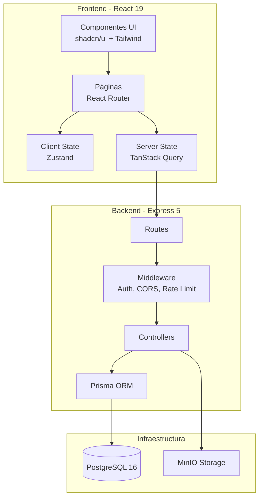

# 📊 SIBA - Project Master Document

> Documento maestro de arquitectura, estado y deudas técnicas del proyecto Sistema Bauman (SIBA).
> **Última actualización**: 2026-02-04

## 📑 Navegación Rápida

[Vista Ejecutiva](#-vista-ejecutiva) • [Arquitectura](#-arquitectura-del-sistema) • [Deudas Técnicas](#-deudas-técnicas-consolidadas) • [Roadmap](#-roadmap-de-mejora) • [Skills](#-skills-y-patrones-documentados) • [Referencias](#-referencias-cruzadas)

---

## 🎯 Vista Ejecutiva

### Semáforo de Salud del Proyecto

| Área                  | Estado       | Hallazgos Clave                                | Acción Inmediata                                          |
| --------------------- | ------------ | ---------------------------------------------- | --------------------------------------------------------- |
| 🔴 **Seguridad**      | **CRÍTICO**  | 5 vulnerabilidades bloqueantes                 | [Ver Plan](./deudas/seguridad-critica.md) (2h de trabajo) |
| 🟡 **UX/Performance** | **ATENCIÓN** | 25 mejoras pendientes (15 UX + 10 performance) | [Ver Plan](./deudas/ux-performance.md) (40h)              |
| 🟢 **Arquitectura**   | **BUENO**    | 6 deudas de escalabilidad no urgentes          | [Ver Plan](./deudas/arquitectura-escalabilidad.md) (80h)  |

### Métricas del Proyecto

| Métrica                        | Valor                               | Estado       |
| ------------------------------ | ----------------------------------- | ------------ |
| **Líneas de Código**           | ~23,000 (15k Frontend + 8k Backend) | ✅           |
| **Cobertura de Tests**         | 0% (sin configurar)                 | ❌ Crítico   |
| **Deudas Técnicas Activas**    | 50+ (clasificadas y priorizadas)    | 🟡           |
| **Progreso de Implementación** | ~30% según IMPLEMENTATION_STATUS.md | 🟡           |
| **Documentación**              | 14 docs + 21 skills                 | ✅ Excelente |

### Stack Tecnológico

[Ver detalle completo](./preparacion-proyecto/02-stack-tecnologico.md)

| Capa                 | Tecnología               | Versión        | Estado         |
| -------------------- | ------------------------ | -------------- | -------------- |
| **Frontend**         | React + Vite             | 19.2.0 + 7.2.4 | ✅ Moderno     |
| **Backend**          | Express + Prisma         | 5.1.0 + 5.22.0 | ✅ Moderno     |
| **Database**         | PostgreSQL               | 16             | ✅ Actualizado |
| **UI Framework**     | Tailwind CSS + shadcn/ui | 3.4.17         | ⚠️ Migrar a v4 |
| **State Management** | Zustand + TanStack Query | 5.x + 5.x      | ✅ Óptimo      |
| **Validation**       | Zod (compartido)         | 3.25.76        | ✅             |
| **Storage**          | MinIO (S3-compatible)    | 8.0.6          | ✅             |

---

## 🏗️ Arquitectura del Sistema

### Visión General

[Ver lineamientos completos](./preparacion-proyecto/03-lineamientos-generales.md)



### Estructura del Monorepo

```
siba/
├── apps/
│   ├── web/                    Frontend React + Vite
│   │   ├── src/
│   │   │   ├── components/     Componentes reutilizables
│   │   │   ├── features/       Módulos por dominio (finanzas, obras, tickets)
│   │   │   ├── pages/          Páginas de la aplicación
│   │   │   ├── stores/         Zustand stores (auth-store.ts)
│   │   │   ├── hooks/          Custom hooks
│   │   │   ├── lib/            Utilidades y configuración
│   │   │   └── types/          Tipos TypeScript
│   │   └── vite.config.ts
│   │
│   └── api/                    Backend Express
│       ├── src/
│       │   ├── controllers/    Lógica de endpoints (14 controllers)
│       │   ├── routes/         Definición de rutas REST
│       │   ├── services/       Lógica de negocio
│       │   ├── middlewares/    Auth, CORS, validación
│       │   ├── lib/            Prisma client, storage
│       │   └── utils/          Logger, helpers
│       └── prisma/
│           └── schema.prisma   Modelo de datos (30+ tablas)
│
├── packages/
│   └── shared/                 Código compartido entre apps
│       └── src/
│           ├── types/          Tipos compartidos
│           └── schemas/        Validadores Zod
│
├── docs/
│   ├── PROJECT_MASTER.md       📍 Este documento
│   ├── deudas/                 Deudas técnicas consolidadas
│   └── preparacion-proyecto/   Documentación de planificación
│
└── .agent/skills/              21 skills documentadas
```

### Módulos Principales

[Ver modelo de datos completo](./preparacion-proyecto/10-modelo-datos-fase1.md)

| Módulo              | Estado        | Entidades Principales        | Controllers                                                                                | Rutas Frontend       |
| ------------------- | ------------- | ---------------------------- | ------------------------------------------------------------------------------------------ | -------------------- |
| **Seguridad**       | ✅ Completo   | User, Role, Permission       | [auth.controller.ts](../apps/api/src/controllers/auth.controller.ts)                       | /login               |
| **Clientes**        | ✅ Completo   | Cliente, Sucursal, Zona      | [client.controller.ts](../apps/api/src/controllers/client.controller.ts)                   | /dashboard/clients   |
| **Tickets**         | 🟡 Parcial    | Ticket, TicketHistorial      | [ticket.controller.ts](../apps/api/src/controllers/ticket.controller.ts) (483 líneas)      | /dashboard/tickets   |
| **Órdenes Trabajo** | ✅ Completo   | OrdenTrabajo, Archivo        | [ot.controller.ts](../apps/api/src/controllers/ot.controller.ts)                           | -                    |
| **Obras**           | ⚠️ Incompleto | Obra, Presupuesto, Item      | [obra.controller.ts](../apps/api/src/controllers/obra.controller.ts)                       | /dashboard/obras     |
| **Finanzas**        | ⚠️ Incompleto | Banco, Cuenta, Movimiento    | [finanzas.controller.ts](../apps/api/src/controllers/finanzas.controller.ts) ⚠️ 533 líneas | /dashboard/finanzas  |
| **RRHH**            | 🟡 Parcial    | Empleado, Vacacion, Ausencia | [empleado.controller.ts](../apps/api/src/controllers/empleado.controller.ts)               | /dashboard/empleados |
| **Maestros**        | ✅ Completo   | Vehiculo, Material, Rubro    | Varios controllers                                                                         | /dashboard/\*        |

### Patrones y Convenciones

**Arquitectura Backend**: Layered Architecture

```
Routes → Middleware → Controllers → Prisma → PostgreSQL
```

**Principios Clave**:

- **RBAC**: Role-Based Access Control (4 roles: ADMIN, SUPERVISOR, TECNICO, CLIENTE)
- **Soft Delete**: Todas las entidades usan `fechaEliminacion` (nunca DELETE físico)
- **Auditoría**: Campos `fechaCreacion`, `fechaActualizacion`, `createdBy`, `updatedBy`
- **Validación**: Zod schemas compartidos entre frontend y backend
- **Type Safety**: TypeScript strict mode en todo el stack

**State Management**:

- **Zustand**: Client state (auth, UI state) con persist middleware
- **TanStack Query**: Server state (datos de API) con caching y refetch automático

**Formularios**:

- React Hook Form + Zod + shadcn/ui components
- Patrón DialogBase para modales de creación/edición

---

## 🔍 Deudas Técnicas Consolidadas

### Clasificación por Severidad

#### 🔴 Seguridad Crítica (5 deudas - BLOQUEANTE PARA PRODUCCIÓN)

[Ver detalle completo con snippets de solución](./deudas/seguridad-critica.md)

| ID          | Deuda                                  | Impacto    | Esfuerzo | Archivos Afectados                                                                                                                      |
| ----------- | -------------------------------------- | ---------- | -------- | --------------------------------------------------------------------------------------------------------------------------------------- |
| **SEC-001** | JWT_SECRET con fallback inseguro       | 🔴 Crítico | 15 min   | [auth.middleware.ts:4](../apps/api/src/middlewares/auth.middleware.ts), [auth.service.ts:6-7](../apps/api/src/services/auth.service.ts) |
| **SEC-002** | Rutas sin autenticación                | 🔴 Crítico | 30 min   | [ticket.routes.ts](../apps/api/src/routes/ticket.routes.ts), [upload.routes.ts](../apps/api/src/routes/upload.routes.ts)                |
| **SEC-003** | Sin rate limiting                      | 🔴 Alto    | 1 hora   | [index.ts](../apps/api/src/index.ts)                                                                                                    |
| **SEC-004** | Bcrypt rounds insuficientes (10 vs 12) | 🟡 Medio   | 5 min    | [auth.service.ts](../apps/api/src/services/auth.service.ts)                                                                             |
| **SEC-005** | Upload sin validación de magic bytes   | 🟡 Medio   | 30 min   | [upload.controller.ts](../apps/api/src/controllers/upload.controller.ts)                                                                |

**⏱️ Tiempo total estimado**: ~2 horas
**⚠️ Estas deudas deben resolverse antes de deployment a producción**

#### 🟡 UX/UI y Performance (25 deudas)

[Ver detalle completo](./deudas/ux-performance.md)

**Distribución**:

- **Mobile-First**: 10 deudas (~12h)
- **Accesibilidad (WCAG)**: 7 deudas (~8h)
- **Micro-interacciones**: 5 deudas (~6h)
- **Performance**: 8 deudas (~14h)

**Highlights**:

- Sin skeleton loaders (usando spinners genéricos)
- Sin lazy loading de routes (bundle inicial grande)
- Filtros no colapsables en móvil
- Target size < 44px en botones de acción (accesibilidad)
- LoginPage no usa componentes estándar (inconsistencia)
- Sin FAB (Floating Action Button) para acción principal en móvil

**⏱️ Tiempo total estimado**: ~40 horas

#### 🟢 Arquitectura y Escalabilidad (6 deudas)

[Ver detalle completo](./deudas/arquitectura-escalabilidad.md)

| ID           | Deuda                                          | Impacto        | Esfuerzo |
| ------------ | ---------------------------------------------- | -------------- | -------- |
| **ARCH-001** | Controllers monolíticos (finanzas: 533 líneas) | Mantenibilidad | 4-8h     |
| **ARCH-002** | Error handler básico sin clasificación         | DX             | 1h       |
| **ARCH-003** | Sin sistema de testing configurado             | Confianza      | 4h setup |
| **ARCH-004** | Sin virtual lists (tablas grandes)             | Performance    | 4h       |
| **ARCH-005** | Sin WebSockets (real-time)                     | UX             | 8h       |
| **ARCH-006** | Sin refresh tokens flow                        | Seguridad      | 2h       |

**⏱️ Tiempo total estimado**: ~80 horas

### Mapa de Calor de Archivos Críticos

Archivos con múltiples deudas técnicas:

| Archivo                                                                      | Deudas | Severidad | Prioridad | Enlaces                |
| ---------------------------------------------------------------------------- | ------ | --------- | --------- | ---------------------- |
| [auth.middleware.ts](../apps/api/src/middlewares/auth.middleware.ts)         | 2      | 🔴🔴      | P0        | SEC-001, SEC-006       |
| [index.ts](../apps/api/src/index.ts) (backend)                               | 2      | 🔴🟡      | P0        | SEC-003, ARCH-002      |
| [ticket.routes.ts](../apps/api/src/routes/ticket.routes.ts)                  | 1      | 🔴        | P0        | SEC-002                |
| [upload.routes.ts](../apps/api/src/routes/upload.routes.ts)                  | 2      | 🔴🟡      | P0        | SEC-002, SEC-005       |
| [finanzas.controller.ts](../apps/api/src/controllers/finanzas.controller.ts) | 1      | 🟢        | P2        | ARCH-001 (533 líneas)  |
| [Input.tsx](../apps/web/src/components/ui/core/Input.tsx)                    | 2      | 🟡        | P1        | A11Y-001, A11Y-002     |
| [LoginPage.tsx](../apps/web/src/pages/auth/LoginPage.tsx)                    | 2      | 🟡        | P1        | UX-007, SEC-007        |
| [TicketsPage.tsx](../apps/web/src/pages/dashboard/tickets/TicketsPage.tsx)   | 3      | 🟡        | P1        | MF-002, MF-006, UX-003 |
| [TopHeader.tsx](../apps/web/src/components/layout/TopHeader.tsx)             | 1      | 🟡        | P1        | MF-001                 |

---

## 🗺️ Roadmap de Mejora

[Ver plan detallado con checklists](./deudas/PRIORIDADES_ROADMAP.md)

### Fase 1: Seguridad Crítica (Sprint 0 - BLOQUEANTE)

**Objetivo**: Cerrar vulnerabilidades antes de producción
**Duración estimada**: 1-2 días (2 horas de desarrollo)
**Responsable**: Backend Lead

**Checklist**:

- [ ] Eliminar JWT_SECRET fallback inseguro (15 min)
- [ ] Proteger rutas /tickets y /upload con authenticateToken (30 min)
- [ ] Implementar express-rate-limit global y en login (1 hora)
- [ ] Validar JWT_SECRET.length >= 32 al startup (10 min)
- [ ] Aumentar bcrypt rounds a 12 (5 min)

**Estado**: ⏳ Pendiente

### Fase 2: UX/Performance Importante (Sprint 1-2)

**Objetivo**: UX competitiva y accesible
**Duración estimada**: 1-2 semanas (40 horas)
**Responsable**: Frontend Lead

**Quick Wins prioritarios** (< 1h cada uno):

- [ ] Skeleton loaders en lugar de spinners (20 min)
- [ ] ConfirmDialog component vs window.confirm() (30 min)
- [ ] ARIA attributes en Input.tsx (20 min)
- [ ] Responsive padding en TopHeader (10 min)

**Mejoras principales**:

- [ ] Lazy loading de routes con React.lazy() (2h)
- [ ] Migrar LoginPage a RHF + Button component (1h)
- [ ] FAB móvil para acción principal (2h)
- [ ] Filtros colapsables en mobile (2h)
- [ ] Botones con target size mínimo 44px (1h)

**Estado**: ⏳ Pendiente

### Fase 3: Arquitectura y Escalabilidad (Sprint 3-8)

**Objetivo**: Código mantenible y escalable
**Duración estimada**: 2-3 meses (80 horas)
**Responsable**: Tech Lead + Team

**Tareas principales**:

- [ ] Configurar Vitest + React Testing Library (4h)
- [ ] Split finanzas.controller.ts en sub-controllers (4h)
- [ ] Mejorar error handler global con clasificación (1h)
- [ ] DataTable genérico reutilizable (6h)
- [ ] Virtual lists con @tanstack/react-virtual (4h)
- [ ] Framer Motion para micro-animaciones (6h)
- [ ] WebSockets para Kanban real-time (8h)

**Estado**: ⏳ Pendiente

---

## 🛠️ Skills y Patrones Documentados

### Catálogo de Skills (21 skills)

[Ver skills completas en .agent/skills/](./.agent/skills/)

| Área        | Skills Disponibles                                                                       | Estado de Implementación                                      |
| ----------- | ---------------------------------------------------------------------------------------- | ------------------------------------------------------------- |
| **UI/UX**   | siba-components, siba-forms, siba-tables, siba-responsive, siba-a11y, siba-notifications | 🟡 85% alineado                                               |
| **API**     | siba-api-patterns, siba-prisma, siba-auth, siba-error-handling, siba-security            | 🟡 70% alineado                                               |
| **Data**    | siba-caching, siba-state-management, siba-file-upload, siba-pdf-export                   | ✅ 95% alineado                                               |
| **Testing** | siba-testing                                                                             | ⚠️ 0% implementado (skill documentada pero sin configuración) |
| **Ops**     | siba-deployment, siba-git-workflow, siba-logging, siba-routing, siba-optimizations       | 🟡 60% alineado                                               |

### Gaps Críticos Detectados

[Ver análisis completo](./deudas/archivo/auditoria_skills_alignment.md)

| Skill                   | Gap                                                  | Impacto    |
| ----------------------- | ---------------------------------------------------- | ---------- |
| **siba-security**       | Rate limiting documentado pero NO implementado       | 🔴 Crítico |
| **siba-error-handling** | Error handler muy básico vs documentación detallada  | 🟡 Medio   |
| **siba-testing**        | Skill completa pero Vitest/Playwright sin configurar | 🟡 Alto    |
| **siba-forms**          | LoginPage no sigue el patrón RHF + Zod               | 🟡 Bajo    |

---

## 📋 Próximos Pasos Recomendados

### Para Desarrolladores

1. **Antes de cualquier commit**: Leer [PRIORIDADES_ROADMAP.md](./deudas/PRIORIDADES_ROADMAP.md)
2. **Antes de implementar feature**: Consultar skill relevante en [.agent/skills/](./.agent/skills/)
3. **Antes de deploy a producción**: Verificar [seguridad-critica.md](./deudas/seguridad-critica.md)

### Para Product Owners

1. Revisar **Semáforo de Salud** (arriba) semanalmente
2. Priorizar **Fase 1** antes de cualquier release a producción
3. Considerar **Fase 2** para competitividad UX en mercado

### Para Tech Lead

1. Asignar **Fase 1** (seguridad) como Sprint 0 bloqueante
2. Configurar **CI/CD con tests** (actualmente 0% cobertura)
3. Implementar **Sentry/OpenTelemetry** para monitoring ([ver plan](./deudas/archivo/estrategia_mejora_escalabilidad.md))

### Para QA/DevOps

1. Configurar alertas de seguridad (rate limiting, JWT validation)
2. Setup de testing E2E con Playwright
3. Monitoring de performance (LCP, FID, CLS)

---

## 🔗 Referencias Cruzadas

### Documentación del Proyecto

| Tema                       | Documento                                                                             | Descripción                                        |
| -------------------------- | ------------------------------------------------------------------------------------- | -------------------------------------------------- |
| **Arquitectura completa**  | [03-lineamientos-generales.md](./preparacion-proyecto/03-lineamientos-generales.md)   | Patrones, convenciones, decisiones arquitectónicas |
| **Modelo de datos**        | [10-modelo-datos-fase1.md](./preparacion-proyecto/10-modelo-datos-fase1.md)           | ERD, schema Prisma, relaciones                     |
| **Stack tecnológico**      | [02-stack-tecnologico.md](./preparacion-proyecto/02-stack-tecnologico.md)             | Justificación de tecnologías elegidas              |
| **Diseño visual**          | [04-diseno-visual.md](./preparacion-proyecto/04-diseno-visual.md)                     | Sistema de diseño, componentes UI                  |
| **Manejo de errores**      | [06-manejo-errores.md](./preparacion-proyecto/06-manejo-errores.md)                   | Clases de error, logging, códigos HTTP             |
| **Convenciones Git**       | [07-convenciones-git.md](./preparacion-proyecto/07-convenciones-git.md)               | Branches, commits, PRs                             |
| **API Documentation**      | [08-documentacion-api.md](./preparacion-proyecto/08-documentacion-api.md)             | Swagger/OpenAPI                                    |
| **Roadmap de fases**       | [09-roadmap-fases.md](./preparacion-proyecto/09-roadmap-fases.md)                     | Planificación de desarrollo                        |
| **Plan de implementación** | [11-plan-implementacion.md](./preparacion-proyecto/11-plan-implementacion.md)         | Tareas técnicas fase por fase                      |
| **Módulo Obras**           | [12-plan-obras-presupuestos.md](./preparacion-proyecto/12-plan-obras-presupuestos.md) | Diseño del módulo de obras                         |
| **Flujo de documentos**    | [13-plan-flujo-documentos.md](./preparacion-proyecto/13-plan-flujo-documentos.md)     | OTs, PDFs, firmas                                  |
| **Módulo Finanzas**        | [14-plan-finanzas.md](./preparacion-proyecto/14-plan-finanzas.md)                     | Diseño del módulo de finanzas                      |

### Deudas Técnicas

| Categoría                 | Documento                                                                      | Contenido                                 |
| ------------------------- | ------------------------------------------------------------------------------ | ----------------------------------------- |
| **Índice general**        | [deudas/README.md](./deudas/README.md)                                         | Guía de navegación del directorio         |
| **Plan de acción**        | [deudas/PRIORIDADES_ROADMAP.md](./deudas/PRIORIDADES_ROADMAP.md)               | Checklists por fase, snippets de solución |
| **Seguridad**             | [deudas/seguridad-critica.md](./deudas/seguridad-critica.md)                   | 5 vulnerabilidades con CVSS scores        |
| **UX/Performance**        | [deudas/ux-performance.md](./deudas/ux-performance.md)                         | 25 deudas clasificadas + Quick Wins       |
| **Arquitectura**          | [deudas/arquitectura-escalabilidad.md](./deudas/arquitectura-escalabilidad.md) | 6 deudas de refactoring                   |
| **Auditorías originales** | [deudas/archivo/](./deudas/archivo/)                                           | 5 documentos de auditoría detallados      |

### Estado de Implementación

| Documento                                               | Descripción                              |
| ------------------------------------------------------- | ---------------------------------------- |
| [IMPLEMENTATION_STATUS.md](../IMPLEMENTATION_STATUS.md) | Estado actual de features implementadas  |
| [ERD_Schema.md](../ERD_Schema.md)                       | Diagrama de entidad-relación actualizado |
| [AGENTS.md](../AGENTS.md)                               | Skills documentadas para agentes IA      |

---

## 🔄 Mantenimiento de Este Documento

### Responsabilidades

| Rol               | Acción                                    | Frecuencia |
| ----------------- | ----------------------------------------- | ---------- |
| **Tech Lead**     | Actualizar semáforo de salud              | Semanal    |
| **Dev Lead**      | Marcar checkboxes de roadmap completados  | Semanal    |
| **QA Lead**       | Actualizar métricas de cobertura de tests | Por sprint |
| **Product Owner** | Revisar progreso de fases                 | Mensual    |

### Cuándo Actualizar

- **Semanalmente**: Checkboxes de roadmap, progreso de fases
- **Mensualmente**: Métricas del proyecto (LOC, cobertura tests)
- **Por nueva auditoría**: Agregar deudas a documentos spoke correspondientes
- **Por sprint completado**: Actualizar semáforo de salud

### Control de Versiones

Este documento sigue versionado Git estándar. Para cambios mayores (nueva auditoría, cambio de arquitectura), crear PR con revisión de Tech Lead.

---

## 📊 Resumen Ejecutivo

**SIBA es un ERP moderno para empresa constructora con arquitectura sólida pero deudas técnicas críticas de seguridad que bloquean deployment a producción.**

### Fortalezas ✅

- Stack moderno y bien elegido (React 19, Express 5, Prisma, PostgreSQL 16)
- Arquitectura limpia y escalable (monorepo, layered architecture)
- Documentación exhaustiva (14 docs + 21 skills)
- Patrones consistentes (RBAC, soft delete, validación Zod compartida)
- Type safety en todo el stack (TypeScript strict)

### Puntos de Atención ⚠️

- **5 vulnerabilidades críticas de seguridad** (2h de trabajo para resolver)
- **0% de cobertura de tests** (riesgo alto en refactorings)
- **Controllers monolíticos** (finanzas.controller.ts = 533 líneas)
- **Sin lazy loading de routes** (bundle inicial grande)
- **Gaps entre skills documentadas y código real** (especialmente seguridad y testing)

### Recomendación Inmediata 🎯

1. **Sprint 0 (bloqueante)**: Resolver 5 vulnerabilidades de seguridad (Fase 1 - 2 horas)
2. **Sprint 1-2**: Implementar quick wins de UX + lazy loading (Fase 2 - 10 horas)
3. **Sprint 3+**: Configurar testing + refactors arquitectónicos (Fase 3 - iterativo)

---

**Última revisión**: 2026-02-04
**Próxima revisión recomendada**: 2026-02-11 (1 semana)
