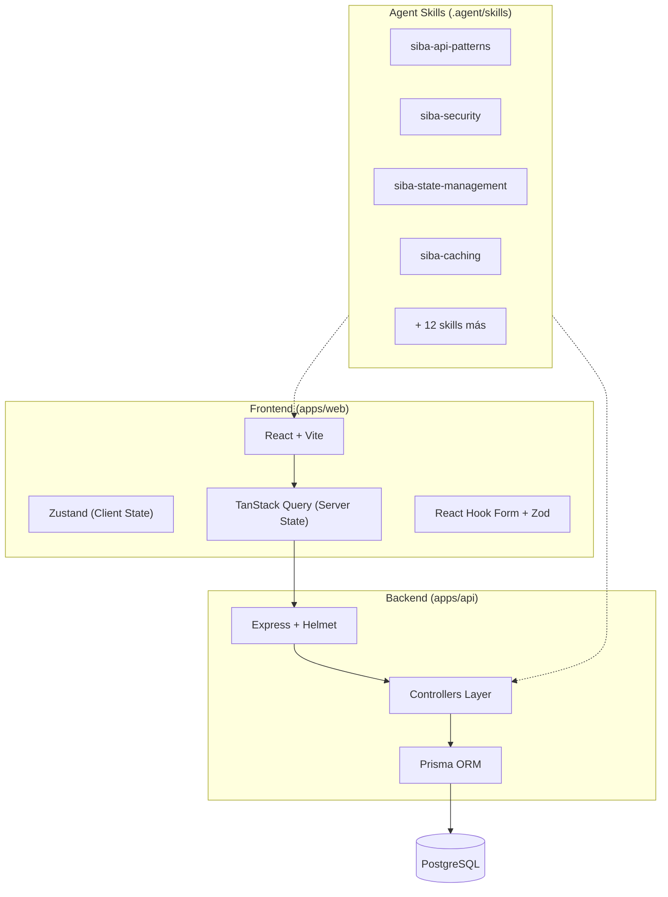
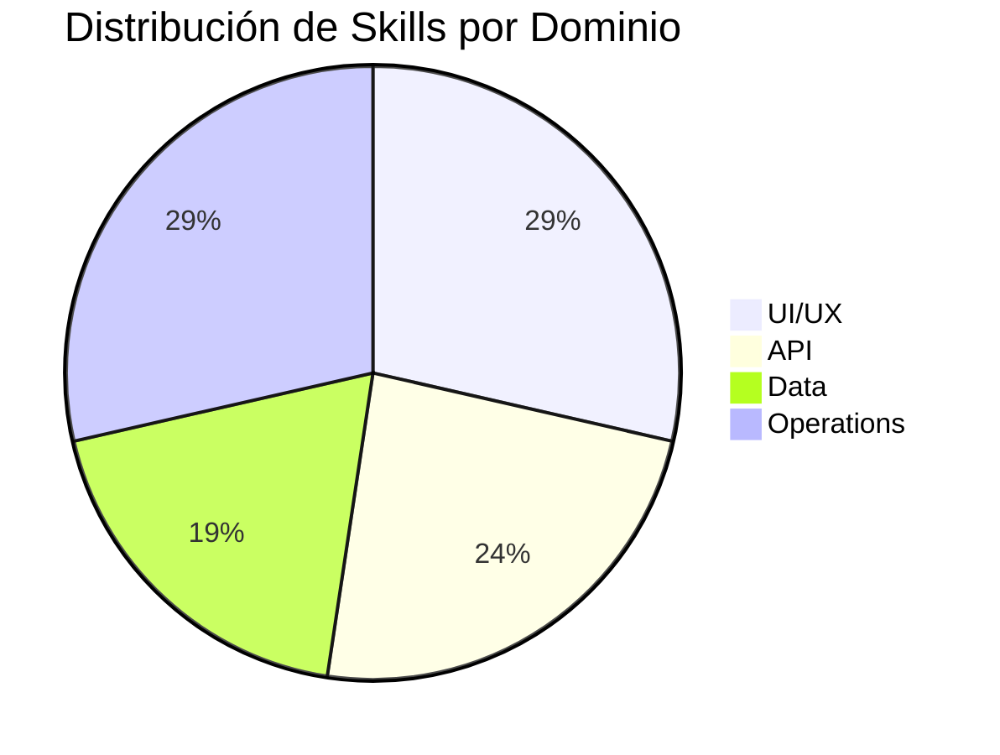
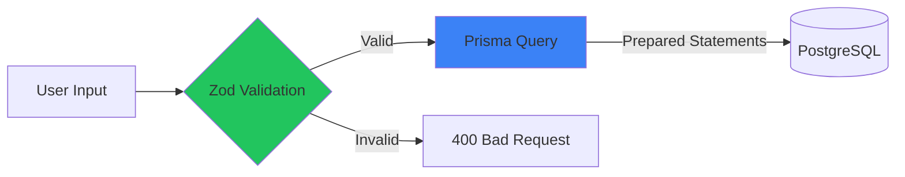
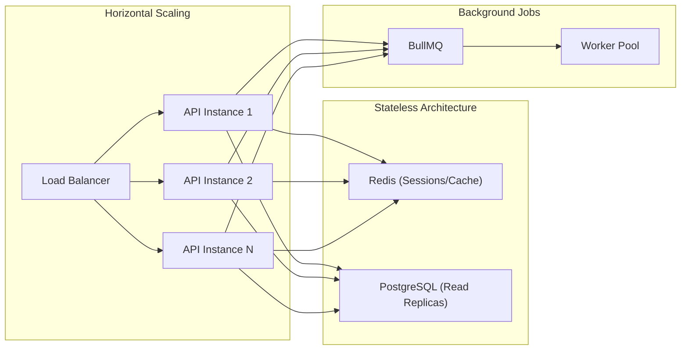

> ⚠️ **NOTA**: Este documento fue consolidado en el Project Master Document.
>
> Ver información actualizada en:
>
> - [PROJECT_MASTER.md](../../PROJECT_MASTER.md) - Vista ejecutiva y semáforo de salud
> - [PRIORIDADES_ROADMAP.md](../PRIORIDADES_ROADMAP.md) - Plan de acción con checklists
> - [arquitectura-escalabilidad.md](../arquitectura-escalabilidad.md) - Consolidado de deudas de arquitectura
>
> Este archivo se mantiene como referencia histórica detallada.

---

# 📋 Documento de Estrategia de Mejora y Escalabilidad

**Proyecto**: SIBA - Sistema de Gestión de Tickets
**Fecha**: 2026-02-04
**Tipo**: Auditoría Técnica & Roadmap de Escalabilidad  
**Stack**: React + Express + Prisma + PostgreSQL

---

## 1. Diagnóstico de Arquitectura Actual

### 1.1 Visión General

El sistema SIBA implementa una arquitectura **monorepo** bien estructurada con separación clara de responsabilidades:



### 1.2 Fortalezas Identificadas

| Área                       | Estado          | Observación                                                 |
| -------------------------- | --------------- | ----------------------------------------------------------- |
| **Separation of Concerns** | ✅ Excelente    | Controllers, routes, services, middlewares bien separados   |
| **Type Safety**            | ✅ Excelente    | TypeScript strict + Zod validation en ambos lados           |
| **State Management**       | ✅ Maduro       | Decisión clara: Zustand (client) vs TanStack Query (server) |
| **Security Headers**       | ✅ Implementado | Helmet, CORS restrictivo, rate limiting documentado         |
| **Soft Delete**            | ✅ Consistente  | `fechaEliminacion` en todas las entidades                   |

### 1.3 Puntos de Atención

> [!WARNING]
> **Rate Limiting**: Documentado en skills pero no confirmado en `index.ts` actual.

> [!CAUTION]
> **Error Handler Global**: Implementación básica, sin clasificación de errores de Prisma/Zod.

```typescript
// Estado actual en index.ts - muy genérico
app.use((err: Error, _req, res, _next) => {
  console.error(err.stack);
  res.status(500).json({ error: 'Something went wrong' });
});
```

---

## 2. Auditoría de Skills (Modularidad y Extensibilidad)

### 2.1 Catálogo de Skills Actuales

Se identifican **16 skills específicas de SIBA** organizadas por dominio:

````carousel
| Dominio | Skills | Cobertura |
|---------|--------|-----------|
| **UI/UX** | `components`, `forms`, `tables`, `responsive`, `a11y`, `notifications` | ✅ Completa |
| **API** | `api-patterns`, `prisma`, `auth`, `error-handling`, `security` | ✅ Completa |
| **Data** | `caching`, `state-management`, `file-upload`, `pdf-export` | ✅ Completa |
| **Ops** | `testing`, `deployment`, `git-workflow`, `logging`, `routing`, `optimizations` | ✅ Completa |
<!-- slide -->

````

### 2.2 Análisis de Patrones Implementados

#### ✅ Strategy Pattern (Implícito)

Las skills actúan como **estrategias intercambiables** para el Agente de IA:

```
Agent Request: "Crear endpoint de usuarios"
    ↓
Skill Discovery: siba-api-patterns, siba-auth, siba-prisma
    ↓
Template Application: Estructura CRUD + Zod + Soft Delete
```

#### ✅ Command Pattern (Potencial)

Los patrones de mutación con TanStack Query siguen una estructura similar a Commands:

```typescript
// Cada mutación es un "comando" encapsulado
const useCreateTicket = () =>
  useMutation({
    mutationFn: (data) => api.post('/tickets', data), // Execute
    onSuccess: () => queryClient.invalidateQueries(['tickets']), // Post-condition
    onError: (err, vars, ctx) => {
      /* Rollback */
    }, // Compensation
  });
```

### 2.3 Recomendaciones de Extensibilidad

> [!IMPORTANT]
> **Gap Identificado**: No existe un mecanismo formal de registro/descubrimiento de skills en runtime.

**Propuesta - Skill Registry Pattern**:

```typescript
// Ejemplo de arquitectura mejorada
interface Skill {
  name: string;
  triggers: string[];
  execute: (context: SkillContext) => Promise<SkillResult>;
  validate?: (input: unknown) => z.ZodSchema;
}

class SkillRegistry {
  private skills = new Map<string, Skill>();

  register(skill: Skill): void {
    /* ... */
  }
  discover(intent: string): Skill[] {
    /* fuzzy match triggers */
  }
  execute(skillName: string, context: SkillContext): Promise<SkillResult> {
    /* ... */
  }
}
```

---

## 3. Plan de Optimización (Performance y Carga)

### 3.1 Frontend - Optimización de Renders

| Patrón            | Estado Actual      | Acción Requerida                                            |
| ----------------- | ------------------ | ----------------------------------------------------------- |
| `React.memo`      | ⚠️ No sistemático  | Aplicar en componentes de lista (rows de tablas)            |
| `useMemo`         | ⚠️ Uso variable    | Estandarizar para filtros y cálculos derivados              |
| `useCallback`     | ⚠️ Uso variable    | Obligatorio para handlers pasados a componentes memorizados |
| **Lazy Loading**  | ✅ Documentado     | Implementar en rutas secundarias                            |
| **Virtual Lists** | ❌ No implementado | Crítico para tablas con >100 rows                           |

**Configuración TanStack Query Recomendada**:

```typescript
// lib/queryClient.ts - Optimización por tipo de dato
const queryClient = new QueryClient({
  defaultOptions: {
    queries: {
      staleTime: 5 * 60 * 1000, // Default: 5 min
      gcTime: 30 * 60 * 1000, // Garbage collection: 30 min
      refetchOnWindowFocus: false, // Evita refetch innecesarios
      retry: 1,
    },
  },
});

// Override para datos estáticos
useQuery({
  queryKey: ['roles'],
  queryFn: fetchRoles,
  staleTime: Infinity, // Nunca stale automáticamente
});
```

### 3.2 Backend - Query Optimization

> [!TIP]
> **Quick Win**: Prisma `select` vs `include` puede reducir payload 60-80%.

```diff
// ❌ Antes: Trae todas las relaciones
const tickets = await prisma.ticket.findMany({
-  include: { sucursal: true, tecnico: true, historial: true },
});

// ✅ Después: Solo campos necesarios
const tickets = await prisma.ticket.findMany({
+  select: {
+    id: true,
+    descripcion: true,
+    estado: true,
+    sucursal: { select: { nombre: true } },
+    tecnico: { select: { nombre: true } },
+  },
});
```

### 3.3 Comunicación Frontend-Backend

| Patrón                 | Caso de Uso              | Estado SIBA     |
| ---------------------- | ------------------------ | --------------- |
| **REST**               | CRUD estándar            | ✅ Implementado |
| **Streaming (SSE)**    | Respuestas largas de IA  | ⚠️ No detectado |
| **WebSockets**         | Notificaciones real-time | ⚠️ No detectado |
| **Optimistic Updates** | Mutaciones instantáneas  | ✅ Documentado  |

**Recomendación para IA Streaming**:

```typescript
// Backend: SSE endpoint para respuestas de IA
app.get('/api/ai/stream', authMiddleware, async (req, res) => {
  res.setHeader('Content-Type', 'text/event-stream');
  res.setHeader('Cache-Control', 'no-cache');
  res.setHeader('Connection', 'keep-alive');

  const stream = await aiService.streamResponse(req.query.prompt);
  for await (const chunk of stream) {
    res.write(`data: ${JSON.stringify(chunk)}\n\n`);
  }
  res.end();
});

// Frontend: EventSource con abort controller
const EventSourcePolyfill = require('eventsource');

function useAIStream(prompt: string) {
  const [result, setResult] = useState('');

  useEffect(() => {
    const source = new EventSource(`/api/ai/stream?prompt=${encodeURIComponent(prompt)}`);
    source.onmessage = (e) => setResult((prev) => prev + JSON.parse(e.data).chunk);
    return () => source.close();
  }, [prompt]);

  return result;
}
```

---

## 4. Matriz de Buenas Prácticas y Seguridad

### 4.1 Control de Acceso

| Control                  | Estado          | Implementación                               |
| ------------------------ | --------------- | -------------------------------------------- |
| JWT con httpOnly cookies | ⚠️ Parcial      | Token en memoria, falta cookie segura        |
| Refresh Tokens           | ❌ No detectado | Crítico para sesiones largas                 |
| Rate Limiting (Login)    | ⚠️ Documentado  | Implementar 5 intentos / 15 min              |
| RBAC (Role-Based Access) | ✅ Implementado | 4 roles: ADMIN, SUPERVISOR, TECNICO, CLIENTE |

### 4.2 Validación y Sanitización



| Vector de Ataque         | Mitigación                            | Estado         |
| ------------------------ | ------------------------------------- | -------------- |
| SQL Injection            | Prisma prepared statements            | ✅ Automático  |
| XSS                      | React escapa por defecto              | ✅ Automático  |
| XSS (HTML raw)           | `dangerouslySetInnerHTML` + DOMPurify | ⚠️ Revisar uso |
| CSRF                     | SameSite cookies / CSRF tokens        | ⚠️ Verificar   |
| Path Traversal (uploads) | Validar extensión + magic bytes       | ✅ Documentado |

### 4.3 Puntos de Falla en Integración IA

> [!CAUTION]
> **Riesgos Específicos de LLM Integration**

| Riesgo                      | Descripción                                    | Mitigación Propuesta                            |
| --------------------------- | ---------------------------------------------- | ----------------------------------------------- |
| **Timeout de Modelo**       | Respuestas de IA pueden exceder timeouts HTTP  | Implementar SSE/streaming, timeout progresivo   |
| **Alucinaciones en Skills** | IA puede generar inputs inválidos para skills  | Validación Zod estricta ANTES de ejecutar skill |
| **Inyección de Prompts**    | User input puede alterar comportamiento        | Sanitizar inputs, separar system/user prompts   |
| **Race Conditions**         | Múltiples skills ejecutándose concurrentemente | Implementar queue con límite de concurrencia    |
| **Token Exhaustion**        | Llamadas ilimitadas a API de IA                | Rate limiting por usuario, contador de tokens   |

**Patrón de Protección Recomendado**:

```typescript
// Middleware de validación pre-skill execution
const skillExecutionMiddleware = async (skillName: string, input: unknown) => {
  // 1. Rate limit check
  const allowed = await rateLimiter.check(userId, 'ai_skill');
  if (!allowed) throw new RateLimitError();

  // 2. Token budget check
  const estimatedTokens = estimateTokens(input);
  if (!(await tokenBudget.canSpend(userId, estimatedTokens))) {
    throw new TokenBudgetExceededError();
  }

  // 3. Input validation (Zod schema por skill)
  const schema = skillRegistry.getSchema(skillName);
  const validated = schema.parse(input); // Throws on invalid

  // 4. Execute with timeout
  const result = await Promise.race([
    skillRegistry.execute(skillName, validated),
    timeout(30000, 'Skill execution timeout'),
  ]);

  // 5. Output sanitization
  return sanitizeOutput(result);
};
```

---

## 5. Roadmap de Escalabilidad

### 5.1 Fase 1: Hardening (2-4 semanas)

- [ ] **Implementar Rate Limiting real** en `apps/api/src/index.ts`
- [ ] **Mejorar Error Handler** con clasificación Prisma/Zod
- [ ] **Añadir Refresh Token** flow
- [ ] **Auditar uso** de `dangerouslySetInnerHTML`
- [ ] **Configurar staleTime** por tipo de entidad

### 5.2 Fase 2: Performance (4-6 semanas)

- [ ] **Lazy loading** en todas las rutas no-críticas
- [ ] **Virtual Lists** con `@tanstack/react-virtual` para tablas
- [ ] **Optimistic Updates** en todas las mutaciones CRUD
- [ ] **Prisma select** en lugar de include donde sea posible
- [ ] **Indexes** en campos de búsqueda frecuente

### 5.3 Fase 3: AI Integration Hardening (6-8 semanas)

- [ ] **SSE/Streaming** para respuestas largas de IA
- [ ] **Token Budget System** por usuario/organización
- [ ] **Queue System** (BullMQ) para skills de alto costo
- [ ] **Skill Registry** con discovery dinámico
- [ ] **Circuit Breaker** para llamadas a APIs externas de IA

### 5.4 Fase 4: Scale (10x usuarios) (8-12 semanas)



| Métrica               | Actual (estimado) | Target 10x | Estrategia                          |
| --------------------- | ----------------- | ---------- | ----------------------------------- |
| Usuarios concurrentes | 50                | 500        | Horizontal scaling + Redis sessions |
| Requests/sec          | 100               | 1000       | Rate limiting + caching layer       |
| DB connections        | 10                | 50         | Connection pooling (PgBouncer)      |
| AI calls/min          | 20                | 100        | Queue + caching de respuestas       |

---

## 6. Checklist de Implementación Inmediata

### Backend (Prioridad Alta)

- [ ] Agregar `express-rate-limit` en `apps/api/src/index.ts`
- [ ] Expandir error handler middleware con códigos Prisma
- [ ] Implementar logging estructurado con request ID
- [ ] Validar JWT_SECRET tiene ≥32 caracteres

### Frontend (Prioridad Alta)

- [ ] Configurar `staleTime` por defecto en QueryClient
- [ ] Implementar Error Boundary global
- [ ] Auditar re-renders con React DevTools Profiler
- [ ] Agregar `React.memo` en componentes de tabla

### AI Integration (Prioridad Media)

- [ ] Documentar schema de input/output por skill
- [ ] Implementar timeout global para llamadas IA
- [ ] Añadir retry con exponential backoff
- [ ] Crear dashboard de uso de tokens

---

> [!NOTE]
> Este documento debe revisarse trimestralmente y actualizarse con métricas reales de producción.

**Próximos Pasos Recomendados**:

1. Priorizar items de Fase 1 (Hardening)
2. Establecer baseline de métricas de performance
3. Implementar monitoring (Sentry, OpenTelemetry)
4. Definir SLAs para tiempos de respuesta de IA
