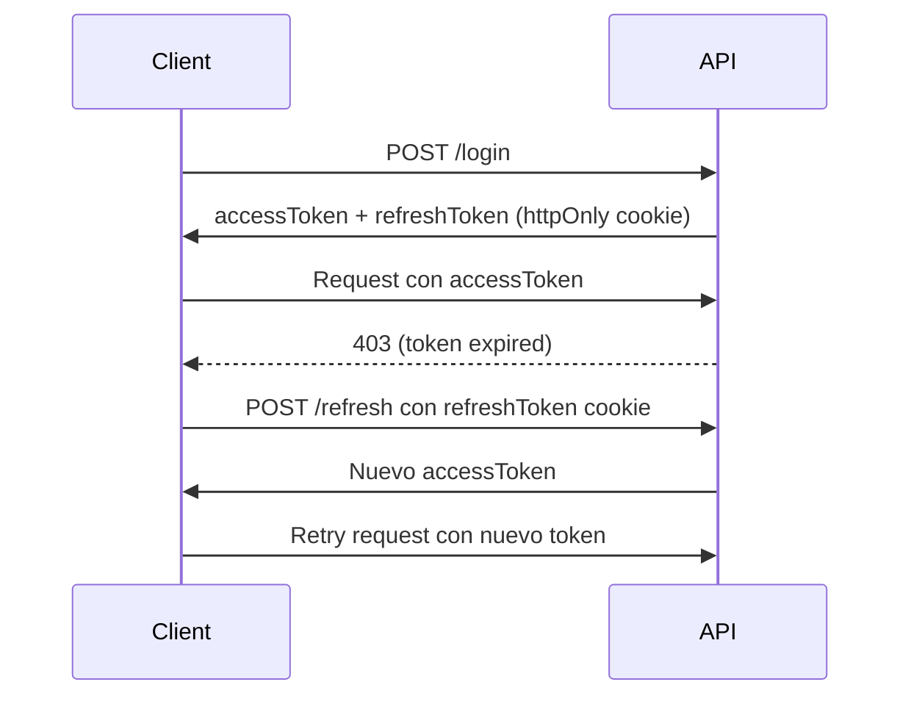

# 🟢 Deudas Técnicas: Arquitectura y Escalabilidad

> Refactorings estructurales para mantenibilidad y escalabilidad a largo plazo.

**Estado**: En progreso (4/6 completados)
**Esfuerzo total**: ~80 horas
**Prioridad**: P2 - Calidad y escalabilidad

---

## 📊 Resumen de Deudas

| ID                                             | Deuda                    | Impacto        | Esfuerzo | Tipo            |
| ---------------------------------------------- | ------------------------ | -------------- | -------- | --------------- |
| [ARCH-001](#arch-001-controllers-monolíticos)  | Controllers monolíticos  | Mantenibilidad | 4-8h     | Refactor        |
| [ARCH-002](#arch-002-error-handler-básico)     | Error handler básico     | DX             | 1h       | Mejora          |
| [ARCH-003](#arch-003-sin-sistema-de-testing)   | Sin sistema de testing   | Confianza      | 4h       | Infraestructura |
| [ARCH-004](#arch-004-sin-virtual-lists)        | Sin virtual lists        | Performance    | 4h       | Feature         |
| [ARCH-005](#arch-005-sin-websockets-real-time) | Sin WebSockets real-time | UX             | 8h       | Feature         |
| [ARCH-006](#arch-006-sin-refresh-tokens-flow)  | Sin refresh tokens flow  | Seguridad/UX   | 2h       | Feature         |

**Total**: 6 deudas | ~23-27 horas (prioritarias)
**Total completo**: ~80 horas (incluye features adicionales)

---

## ARCH-001: Controllers Monolíticos ✅ (Parcial)

### 📌 Descripción

Varios controllers violan el **Single Responsibility Principle (SRP)** al manejar múltiples subdominios en un solo archivo de 400-500+ líneas, dificultando el mantenimiento y testing.

### 🎯 Ubicación y Métricas

| Controller                                                                  | Líneas             | Estado        | Prioridad |
| --------------------------------------------------------------------------- | ------------------ | ------------- | --------- |
| [finanzas/](../../apps/api/src/controllers/finanzas/)                       | **533→5 archivos** | ✅ Completado | P1        |
| [ticket.controller.ts](../../apps/api/src/controllers/ticket.controller.ts) | **483**            | 🟡 Atención   | P2        |
| [obra.controller.ts](../../apps/api/src/controllers/obra.controller.ts)     | ~400               | 🟡 Revisar    | P3        |

**Umbral aceptable**: 200 líneas por controller

### ⚠️ Impacto

- **Mantenibilidad**: Difícil encontrar y modificar funciones específicas
- **Testing**: Tests gigantes y difíciles de mantener
- **Colaboración**: Conflictos frecuentes en Git (múltiples devs editando mismo archivo)
- **Code Review**: PRs de 500+ líneas difíciles de revisar

### 🐛 Problema Actual

```typescript
// ❌ finanzas.controller.ts (533 líneas)
export class FinanzasController {
  // Bancos (50 líneas)
  async getBancos() { ... }
  async createBanco() { ... }
  async updateBanco() { ... }

  // Cuentas financieras (80 líneas)
  async getCuentas() { ... }
  async createCuenta() { ... }
  async updateCuenta() { ... }

  // Movimientos (150 líneas)
  async getMovimientos() { ... }
  async createMovimiento() { ... }
  async getMovimientosByFecha() { ... }
  async getMovimientosByCuenta() { ... }

  // Dashboard financiero (100 líneas)
  async getDashboardStats() { ... }
  async getGraficosIngresos() { ... }
  async getGraficosEgresos() { ... }

  // Importación masiva (120 líneas)
  async importarMovimientos() { ... }
  async validarImportacion() { ... }
  async procesarImportacion() { ... }

  // Helpers privados (30 líneas)
  private calcularBalance() { ... }
  private validarMovimiento() { ... }
}
```

### ✅ Solución: Split por Subdominio

**Nueva estructura**:

```
apps/api/src/controllers/finanzas/
├── index.ts                    # Re-exporta todos los controllers
├── banco.controller.ts         # ~50 líneas - CRUD de bancos
├── cuenta.controller.ts        # ~80 líneas - CRUD de cuentas
├── movimiento.controller.ts    # ~150 líneas - CRUD de movimientos
├── dashboard.controller.ts     # ~100 líneas - Stats y gráficos
├── importacion.controller.ts   # ~120 líneas - Importación masiva
├── shared/
│   └── helpers.ts              # ~30 líneas - Funciones compartidas
└── schemas/
    └── finanzas.schemas.ts     # Zod schemas
```

**Implementación**:

```typescript
// ✅ apps/api/src/controllers/finanzas/banco.controller.ts
import { bancosSchemas } from './schemas/finanzas.schemas';

export class BancoController {
  async getAll(req: Request, res: Response) {
    const bancos = await prisma.banco.findMany({
      where: { fechaEliminacion: null },
    });
    res.json({ data: bancos });
  }

  async create(req: Request, res: Response) {
    const data = bancosSchemas.create.parse(req.body);
    const banco = await prisma.banco.create({ data });
    res.json({ data: banco });
  }

  // ... más métodos CRUD
}

export const bancoController = new BancoController();
```

```typescript
// ✅ apps/api/src/controllers/finanzas/index.ts
export { bancoController } from './banco.controller';
export { cuentaController } from './cuenta.controller';
export { movimientoController } from './movimiento.controller';
export { dashboardController } from './dashboard.controller';
export { importacionController } from './importacion.controller';
```

**Actualizar routes**:

```typescript
// apps/api/src/routes/finanzas.routes.ts
import {
  bancoController,
  cuentaController,
  movimientoController,
  dashboardController,
} from '../controllers/finanzas';

router.get('/bancos', bancoController.getAll);
router.post('/bancos', bancoController.create);

router.get('/cuentas', cuentaController.getAll);
router.post('/cuentas', cuentaController.create);

// etc...
```

### 🧪 Testing

```bash
# Test 1: Verificar que todos los endpoints siguen funcionando
npm run test:e2e -- finanzas

# Test 2: Verificar que no hay imports rotos
npm run type-check

# Test 3: Verificar que controllers exportan correctamente
node -e "const { bancoController } = require('./dist/controllers/finanzas'); console.log(bancoController)"
```

### 📊 Beneficios

- ✅ Archivos de 50-150 líneas (fáciles de entender)
- ✅ Testing más granular y rápido
- ✅ Menos conflictos en Git
- ✅ Code review más eficiente
- ✅ Reutilización de helpers compartidos

### ⏱️ Esfuerzo

- **finanzas.controller.ts**: 4-6 horas
- **ticket.controller.ts**: 3-4 horas
- **obra.controller.ts**: 3-4 horas

**Total**: 10-14 horas

---

## ARCH-002: Error Handler Básico ✅

### 📌 Descripción

El error handler global actual no clasifica errores (Prisma, Zod, custom), retorna mensajes genéricos y dificulta el debugging.

### Estado: Implementado

**Solución implementada**:

- Clase `AppError` con jerarquía de errores en `lib/errors.ts`
- Middleware centralizado en `middlewares/error.middleware.ts`
- Clasificación automática de: Prisma (P2002→409, P2025→404), Zod (400 con field details), AppError, JSON parse errors
- Respuesta estructurada: `{ success: false, error: { code, message, details? } }`
- Stack traces solo en desarrollo
- `notFoundHandler` para catch-all 404
- `client.controller.ts` refactorizado como ejemplo (sin try/catch manual)

### 🐛 Problema Actual

```typescript
// ❌ Error handler muy genérico
app.use((err, req, res, next) => {
  console.error(err);
  res.status(500).json({
    error: 'Internal server error',
  });
});
```

**Problemas**:

- Todos los errores retornan 500
- No diferencia entre Prisma, Zod, custom errors
- Mensajes no descriptivos
- Sin códigos de error estructurados

### ✅ Solución

**Ver implementación completa**: [PRIORIDADES_ROADMAP.md](./PRIORIDADES_ROADMAP.md#arch-002-mejorar-error-handler-global-1-hora)

**Características**:

- Clasificación de errores (Prisma, Zod, AppError custom)
- Códigos de error estructurados (`VALIDATION_ERROR`, `NOT_FOUND`, etc.)
- Status codes correctos (400, 404, 409, 500)
- Logging estructurado para producción

### ⏱️ Esfuerzo

1 hora

---

## ARCH-003: Sin Sistema de Testing

### 📌 Descripción

El proyecto no tiene configuración de tests (0% cobertura), lo que aumenta el riesgo de regresiones en refactorings y deploys.

### ⚠️ Impacto

- **Alto riesgo** en refactorings (ej: split de controllers)
- **Baja confianza** en deploys
- **Debugging lento** (sin tests que reproduzcan bugs)

### ✅ Solución

**Frontend**: Vitest + React Testing Library

**Backend**: Vitest + Supertest

**E2E**: Playwright

**Ver setup completo**: [PRIORIDADES_ROADMAP.md](./PRIORIDADES_ROADMAP.md#arch-003-configurar-vitest--rtl-4-horas)

### 📊 Target de Cobertura

| Tipo                                | Coverage Target            |
| ----------------------------------- | -------------------------- |
| Components críticos (Input, Button) | 90%                        |
| Features (Tickets, Finanzas)        | 70%                        |
| Helpers/Utils                       | 80%                        |
| E2E (flujos críticos)               | 100% (login, crear ticket) |

### ⏱️ Esfuerzo

- **Setup**: 4 horas
- **Tests iniciales**: 20+ horas (ongoing)

---

## ARCH-004: Sin Virtual Lists ✅

### 📌 Descripción

Tablas con 500+ filas causan lag porque se renderizan todas las filas aunque solo ~30 sean visibles.

### Estado: Implementado

**Solución implementada** (durante fase UX/Performance):

- Componente `VirtualTable.tsx` con `@tanstack/react-virtual`
- Hook `useVirtualList.ts` reutilizable
- Solo renderiza filas visibles (~30) en lugar de todas (1000+)

### ⚠️ Impacto

**Tablas afectadas**:

- Movimientos financieros (1000+ registros)
- Tickets históricos (500+ registros)
- Empleados (100+ en empresas grandes)

**Performance actual**:

- 1000 filas = ~500ms de render inicial
- Scroll lag notable

### ✅ Solución

Integrar `@tanstack/react-virtual` para renderizar solo filas visibles.

**Beneficio esperado**: Render de 30-50 filas en lugar de 1000+ (reducción de 95%)

**Ver implementación**: [PRIORIDADES_ROADMAP.md](./PRIORIDADES_ROADMAP.md#arch-005-virtual-lists-4-horas)

### ⏱️ Esfuerzo

4 horas

---

## ARCH-005: Sin WebSockets Real-Time

### 📌 Descripción

El Kanban de tickets usa polling cada 30s en lugar de actualizaciones real-time, causando:

- Latencia de hasta 30s para ver cambios
- Carga innecesaria en servidor
- Conflictos al mover tickets simultáneamente

### ✅ Solución

Implementar Socket.IO para:

- Actualizaciones real-time en Kanban
- Notificaciones push de nuevos tickets
- Indicador de "usuario X está editando..."

### 🏗️ Arquitectura Propuesta

**Backend**:

```typescript
// apps/api/src/socket.ts
import { Server } from 'socket.io';

export function setupWebSocket(httpServer) {
  const io = new Server(httpServer, {
    cors: { origin: process.env.FRONTEND_URL },
  });

  io.on('connection', (socket) => {
    // Subscribe a sala de tickets
    socket.on('subscribe:tickets', () => {
      socket.join('tickets');
    });

    // Broadcast cuando un ticket cambia
    socket.on('ticket:update', (data) => {
      io.to('tickets').emit('ticket:updated', data);
    });
  });

  return io;
}
```

**Frontend**:

```typescript
// apps/web/src/hooks/useRealtimeTickets.ts
import { useEffect } from 'react';
import { io } from 'socket.io-client';
import { useQueryClient } from '@tanstack/react-query';

export function useRealtimeTickets() {
  const queryClient = useQueryClient();

  useEffect(() => {
    const socket = io('http://localhost:3003');

    socket.emit('subscribe:tickets');

    socket.on('ticket:updated', (ticket) => {
      // Invalidar query para refetch automático
      queryClient.invalidateQueries({ queryKey: ['tickets'] });
    });

    return () => socket.disconnect();
  }, []);
}
```

### ⏱️ Esfuerzo

- **Setup básico**: 4 horas
- **Implementación completa**: 8 horas

---

## ARCH-006: Sin Refresh Tokens Flow ✅

### 📌 Descripción

El sistema usa solo access tokens de 15min. Cuando expiran, el usuario debe hacer login nuevamente, generando fricciones.

### Estado: Implementado

**Solución implementada**:

- Modelo `RefreshToken` en Prisma (tabla `refresh_tokens`)
- Token opaco de 128 chars (crypto.randomBytes) almacenado en DB
- Cookie httpOnly, secure, sameSite: 'lax', path: '/api/auth'
- Rotación de token en cada refresh (previene reutilización)
- Revocación server-side (deleteRefreshToken, deleteAllRefreshTokens)
- Frontend ya tenía interceptor 401→refresh configurado (sin cambios necesarios)
- Eliminada dependencia de `JWT_REFRESH_SECRET`

### ✅ Solución

Implementar refresh tokens:

- Access token: 15 minutos (en memoria)
- Refresh token: 7 días (httpOnly cookie)
- Endpoint `/api/auth/refresh` para renovar access token

### 🏗️ Flujo Propuesto



### ⏱️ Esfuerzo

2 horas

---

## 📊 Dashboard de Progreso

| ID       | Completada            | Responsable   | Fecha      |
| -------- | --------------------- | ------------- | ---------- |
| ARCH-001 | ✅ Parcial (finanzas) | Backend Lead  | 2026-02-06 |
| ARCH-002 | ✅ Completado         | Backend Lead  | 2026-02-06 |
| ARCH-003 | ⏳ Pendiente          | Tech Lead     | -          |
| ARCH-004 | ✅ Completado         | Frontend Lead | 2026-02-06 |
| ARCH-005 | ⏳ Pendiente          | Full Stack    | -          |
| ARCH-006 | ✅ Completado         | Backend Lead  | 2026-02-06 |

**Progreso total**: 4/6 (67%)

---

## 🗺️ Roadmap Recomendado

### Sprint 3-4 (Fundamentos) ✅

- [x] ARCH-002: Error handler mejorado (1h) ✅
- [ ] ARCH-003: Setup de testing (4h)
- [x] ARCH-006: Refresh tokens (2h) ✅

**Total**: 7 horas (5h completadas)

### Sprint 5-6 (Refactors) ✅

- [x] ARCH-001: Split finanzas.controller.ts (6h) ✅
- [x] ARCH-004: Virtual lists (4h) ✅ (implementado en fase UX)

**Total**: 10 horas ✅ Completado

### Sprint 7-8 (Features Avanzados)

- [ ] ARCH-005: WebSockets real-time (8h)
- [ ] ARCH-001: Split ticket.controller.ts y obra.controller.ts (8h)

**Total**: 16 horas

---

## 📚 Referencias

### Auditorías Originales

- [estrategia_mejora_escalabilidad.md](./archivo/estrategia_mejora_escalabilidad.md) - Análisis completo de escalabilidad
- [auditoria_skills_alignment.md](./archivo/auditoria_skills_alignment.md) - Controllers monolíticos

### Skills Relacionadas

- [siba-api-patterns](../../.agent/skills/siba-api-patterns/SKILL.md)
- [siba-testing](../../.agent/skills/siba-testing/SKILL.md)
- [siba-optimizations](../../.agent/skills/siba-optimizations/SKILL.md)

### Recursos Externos

- [Testing Library Best Practices](https://testing-library.com/docs/queries/about)
- [Socket.IO Documentation](https://socket.io/docs/v4/)
- [TanStack Virtual](https://tanstack.com/virtual/latest)

---

**Última actualización**: 2026-02-06
**Responsable**: Tech Lead
