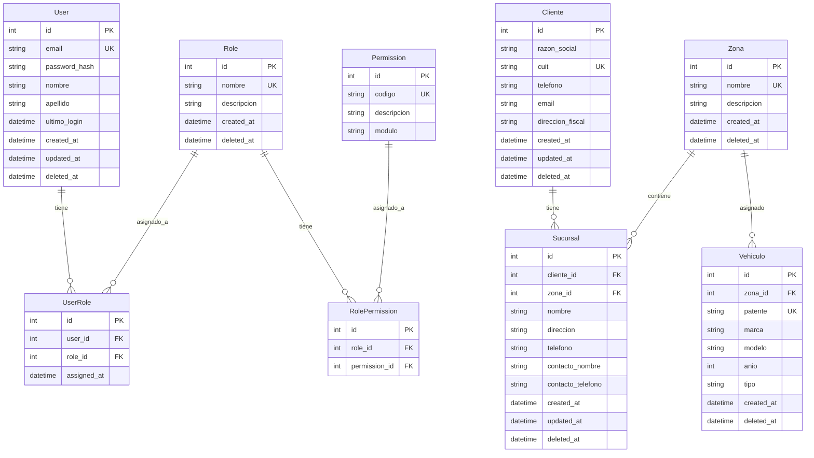

# Sistema Bauman - Modelo de Datos (Fase 1)

> **Versión**: 1.1  
> **Fase**: 1 - Seguridad + Maestros Base

---

## ⚠️ Patrón Obligatorio: Soft Delete

**Todas las tablas usan borrado lógico con `deleted_at`:**

| Campo | Tipo | Descripción |
|-------|------|-------------|
| `deleted_at` | TIMESTAMP NULL | `NULL` = activo, `fecha` = eliminado |

```typescript
// Nunca usar DELETE físico
await prisma.cliente.delete({ where: { id } }); // ❌ PROHIBIDO

// Usar soft delete
await prisma.cliente.update({
  where: { id },
  data: { deletedAt: new Date() }
}); // ✅ CORRECTO
```

---

## 📊 Diagrama ER (Mermaid)



---

## 📋 Campos Estándar en Todas las Tablas

| Campo | Tipo | Null | Descripción |
|-------|------|------|-------------|
| `id` | SERIAL | PK | Identificador único |
| `created_at` | TIMESTAMP | NO | Fecha de creación |
| `updated_at` | TIMESTAMP | NO | Fecha de última modificación |
| `deleted_at` | TIMESTAMP | SI | Fecha de borrado lógico (null = activo) |

---

## 📋 Detalle de Tablas

### 🔐 Módulo: Seguridad

#### User (Usuarios)

| Campo | Tipo | Null | Descripción |
|-------|------|------|-------------|
| id | SERIAL | PK | Identificador único |
| email | VARCHAR(255) | UK | Email único para login |
| password_hash | VARCHAR(255) | NO | Hash bcrypt de contraseña |
| nombre | VARCHAR(100) | NO | Nombre del usuario |
| apellido | VARCHAR(100) | NO | Apellido del usuario |
| ultimo_login | TIMESTAMP | SI | Fecha/hora del último login |
| created_at | TIMESTAMP | NO | Fecha de creación |
| updated_at | TIMESTAMP | NO | Fecha de última modificación |
| **deleted_at** | TIMESTAMP | SI | **Soft delete** |

#### Role (Roles)

| Campo | Tipo | Null | Descripción |
|-------|------|------|-------------|
| id | SERIAL | PK | Identificador único |
| nombre | VARCHAR(50) | UK | Nombre del rol |
| descripcion | VARCHAR(255) | SI | Descripción del rol |
| created_at | TIMESTAMP | NO | Fecha de creación |
| **deleted_at** | TIMESTAMP | SI | **Soft delete** |

**Roles iniciales:**
- `admin` - Acceso total al sistema
- `gerente` - Gestión general, finanzas, usuarios
- `comercial` - Solo tickets y obras

#### Permission (Permisos)

| Campo | Tipo | Null | Descripción |
|-------|------|------|-------------|
| id | SERIAL | PK | Identificador único |
| codigo | VARCHAR(50) | UK | Código único (ej: clientes:read) |
| descripcion | VARCHAR(255) | SI | Descripción del permiso |
| modulo | VARCHAR(50) | NO | Módulo al que pertenece |

> **Nota**: Permisos no tienen soft delete (son configuración fija)

#### UserRole y RolePermission

Tablas pivote sin soft delete (relaciones se eliminan físicamente al hacer soft delete del padre).

---

### 📋 Módulo: Maestros

#### Cliente

| Campo | Tipo | Null | Descripción |
|-------|------|------|-------------|
| id | SERIAL | PK | Identificador único |
| razon_social | VARCHAR(200) | NO | Nombre/Razón social |
| cuit | VARCHAR(13) | UK | CUIT (formato: XX-XXXXXXXX-X) |
| telefono | VARCHAR(20) | SI | Teléfono principal |
| email | VARCHAR(255) | SI | Email de contacto |
| direccion_fiscal | VARCHAR(255) | SI | Dirección fiscal |
| created_at | TIMESTAMP | NO | Fecha de creación |
| updated_at | TIMESTAMP | NO | Fecha de modificación |
| **deleted_at** | TIMESTAMP | SI | **Soft delete** |

#### Zona

| Campo | Tipo | Null | Descripción |
|-------|------|------|-------------|
| id | SERIAL | PK | Identificador único |
| nombre | VARCHAR(100) | UK | Nombre de la zona |
| descripcion | VARCHAR(255) | SI | Descripción opcional |
| created_at | TIMESTAMP | NO | Fecha de creación |
| **deleted_at** | TIMESTAMP | SI | **Soft delete** |

#### Sucursal

| Campo | Tipo | Null | Descripción |
|-------|------|------|-------------|
| id | SERIAL | PK | Identificador único |
| cliente_id | INT | FK | Referencia a Cliente |
| zona_id | INT | FK | Referencia a Zona |
| nombre | VARCHAR(100) | NO | Nombre de la sucursal |
| direccion | VARCHAR(255) | NO | Dirección completa |
| telefono | VARCHAR(20) | SI | Teléfono de sucursal |
| contacto_nombre | VARCHAR(100) | SI | Nombre del contacto |
| contacto_telefono | VARCHAR(20) | SI | Teléfono del contacto |
| created_at | TIMESTAMP | NO | Fecha de creación |
| updated_at | TIMESTAMP | NO | Fecha de modificación |
| **deleted_at** | TIMESTAMP | SI | **Soft delete** |

#### Vehiculo

| Campo | Tipo | Null | Descripción |
|-------|------|------|-------------|
| id | SERIAL | PK | Identificador único |
| zona_id | INT | FK | Zona asignada |
| patente | VARCHAR(10) | UK | Patente del vehículo |
| marca | VARCHAR(50) | SI | Marca del vehículo |
| modelo | VARCHAR(50) | SI | Modelo |
| anio | INT | SI | Año de fabricación |
| tipo | VARCHAR(30) | SI | Tipo (camioneta, utilitario) |
| created_at | TIMESTAMP | NO | Fecha de creación |
| **deleted_at** | TIMESTAMP | SI | **Soft delete** |

---

## 🔨 Prisma Schema (Fase 1)

```prisma
// prisma/schema.prisma

generator client {
  provider = "prisma-client-js"
}

datasource db {
  provider = "postgresql"
  url      = env("DATABASE_URL")
}

// ============ SEGURIDAD ============

model User {
  id           Int        @id @default(autoincrement())
  email        String     @unique
  passwordHash String     @map("password_hash")
  nombre       String
  apellido     String
  ultimoLogin  DateTime?  @map("ultimo_login")
  createdAt    DateTime   @default(now()) @map("created_at")
  updatedAt    DateTime   @updatedAt @map("updated_at")
  deletedAt    DateTime?  @map("deleted_at")

  roles UserRole[]

  @@map("users")
}

model Role {
  id          Int       @id @default(autoincrement())
  nombre      String    @unique
  descripcion String?
  createdAt   DateTime  @default(now()) @map("created_at")
  deletedAt   DateTime? @map("deleted_at")

  users       UserRole[]
  permissions RolePermission[]

  @@map("roles")
}

model Permission {
  id          Int    @id @default(autoincrement())
  codigo      String @unique
  descripcion String?
  modulo      String

  roles RolePermission[]

  @@map("permissions")
}

model UserRole {
  id         Int      @id @default(autoincrement())
  userId     Int      @map("user_id")
  roleId     Int      @map("role_id")
  assignedAt DateTime @default(now()) @map("assigned_at")

  user User @relation(fields: [userId], references: [id], onDelete: Cascade)
  role Role @relation(fields: [roleId], references: [id], onDelete: Cascade)

  @@unique([userId, roleId])
  @@map("user_roles")
}

model RolePermission {
  id           Int @id @default(autoincrement())
  roleId       Int @map("role_id")
  permissionId Int @map("permission_id")

  role       Role       @relation(fields: [roleId], references: [id], onDelete: Cascade)
  permission Permission @relation(fields: [permissionId], references: [id], onDelete: Cascade)

  @@unique([roleId, permissionId])
  @@map("role_permissions")
}

// ============ MAESTROS ============

model Cliente {
  id              Int       @id @default(autoincrement())
  razonSocial     String    @map("razon_social")
  cuit            String    @unique
  telefono        String?
  email           String?
  direccionFiscal String?   @map("direccion_fiscal")
  createdAt       DateTime  @default(now()) @map("created_at")
  updatedAt       DateTime  @updatedAt @map("updated_at")
  deletedAt       DateTime? @map("deleted_at")

  sucursales Sucursal[]

  @@map("clientes")
}

model Zona {
  id          Int       @id @default(autoincrement())
  nombre      String    @unique
  descripcion String?
  createdAt   DateTime  @default(now()) @map("created_at")
  deletedAt   DateTime? @map("deleted_at")

  sucursales Sucursal[]
  vehiculos  Vehiculo[]

  @@map("zonas")
}

model Sucursal {
  id               Int       @id @default(autoincrement())
  clienteId        Int       @map("cliente_id")
  zonaId           Int       @map("zona_id")
  nombre           String
  direccion        String
  telefono         String?
  contactoNombre   String?   @map("contacto_nombre")
  contactoTelefono String?   @map("contacto_telefono")
  createdAt        DateTime  @default(now()) @map("created_at")
  updatedAt        DateTime  @updatedAt @map("updated_at")
  deletedAt        DateTime? @map("deleted_at")

  cliente Cliente @relation(fields: [clienteId], references: [id])
  zona    Zona    @relation(fields: [zonaId], references: [id])

  @@map("sucursales")
}

model Vehiculo {
  id        Int       @id @default(autoincrement())
  zonaId    Int       @map("zona_id")
  patente   String    @unique
  marca     String?
  modelo    String?
  anio      Int?
  tipo      String?
  createdAt DateTime  @default(now()) @map("created_at")
  deletedAt DateTime? @map("deleted_at")

  zona Zona @relation(fields: [zonaId], references: [id])

  @@map("vehiculos")
}
```

---

## � Implementación de Soft Delete

### Middleware Prisma (Automático)

```typescript
// prisma/middleware/softDelete.ts
import { Prisma } from '@prisma/client';

// Modelos con soft delete
const softDeleteModels = ['User', 'Role', 'Cliente', 'Zona', 'Sucursal', 'Vehiculo'];

export function softDeleteMiddleware(): Prisma.Middleware {
  return async (params, next) => {
    // Interceptar DELETE → UPDATE con deletedAt
    if (params.action === 'delete' && softDeleteModels.includes(params.model ?? '')) {
      params.action = 'update';
      params.args.data = { deletedAt: new Date() };
    }

    if (params.action === 'deleteMany' && softDeleteModels.includes(params.model ?? '')) {
      params.action = 'updateMany';
      if (params.args.data !== undefined) {
        params.args.data.deletedAt = new Date();
      } else {
        params.args.data = { deletedAt: new Date() };
      }
    }

    // Filtrar automáticamente registros eliminados en findMany
    if (params.action === 'findMany' && softDeleteModels.includes(params.model ?? '')) {
      if (!params.args) params.args = {};
      if (!params.args.where) params.args.where = {};
      if (params.args.where.deletedAt === undefined) {
        params.args.where.deletedAt = null;
      }
    }

    return next(params);
  };
}
```

### Uso

```typescript
// Soft delete automático
await prisma.cliente.delete({ where: { id: 1 } }); 
// → UPDATE clientes SET deleted_at = NOW() WHERE id = 1

// Buscar solo activos (automático)
await prisma.cliente.findMany(); 
// → WHERE deleted_at IS NULL

// Buscar incluyendo eliminados
await prisma.cliente.findMany({ where: { deletedAt: { not: null } } });
```

---

## 📝 Notas

1. **Soft delete obligatorio**: Nunca borrar físicamente registros
2. **`deleted_at` NULL** = registro activo
3. **`deleted_at` con fecha** = registro eliminado
4. **Permisos y tablas pivote**: Sin soft delete (configuración fija)
5. **CUIT único**: Validar formato XX-XXXXXXXX-X en aplicación
