# Plan de Implementación: Módulo de Flujo de Documentos (Fase 5)

Este módulo proporciona trazabilidad completa del ciclo de vida de un trabajo, desde el Ticket inicial hasta la facturación final, registrando cada documento generado con sus timestamps y estados.

---

## 🎯 Objetivos de Negocio

1. **Trazabilidad Completa**: Visualizar el recorrido de un trabajo desde su origen (Ticket) hasta su cierre (Factura).
2. **Auditoría de Tiempos**: Conocer exactamente cuánto tiempo pasó entre cada etapa del flujo.
3. **Métricas de Eficiencia**: Detectar cuellos de botella en el proceso (ej: presupuestos que tardan en aprobarse).
4. **Vista Unificada**: Un solo lugar para ver todos los documentos relacionados a un trabajo.

---

## 📊 Flujo de Documentos (Ciclo de Vida)

```mermaid
flowchart LR
    T[🎫 Ticket] --> OT[📋 Orden de Trabajo]
    OT --> O[🏗️ Obra]
    O --> P[💰 Presupuesto v1..N]
    P --> A[✅ Aprobación]
    A --> E[🔨 Ejecución]
    E --> F[💳 Factura]
```



### Entidades del Flujo

| Documento | Origen | Timestamps Clave |
|-----------|--------|------------------|
| **Ticket** | Alta manual / Sistema externo | `fechaCreacion`, `fechaProgramada`, `fechaFinalizacion` |
| **Orden de Trabajo (OT)** | Derivado de Ticket | `fechaOT`, `fechaCreacion` |
| **Obra** | Derivado de OT (o directo) | `fechaSolicitud`, `fechaInicioReal`, `fechaFinReal` |
| **Presupuesto** | Asociado a Obra | `fechaCreacion`, `fechaEnvio`, `fechaRespuesta` |
| **Factura** | Cierre del ciclo | `fechaEmision`, `fechaCobro` |

---

## 💾 Schema Database (Prisma)

### 1. Enums

```prisma
enum TipoDocumento {
  TICKET
  ORDEN_TRABAJO
  OBRA
  PRESUPUESTO
  FACTURA
}

enum TipoEvento {
  CREACION
  CAMBIO_ESTADO
  ENVIO
  APROBACION
  RECHAZO
  MODIFICACION
  CIERRE
}
```

### 2. Modelo Principal: DocumentoFlujo

Este modelo unifica la referencia a cualquier documento del sistema para permitir queries transversales.

```prisma
model DocumentoFlujo {
  id                Int           @id @default(autoincrement())
  tipo              TipoDocumento
  referenciaId      Int           @map("referencia_id")  // ID del documento original
  codigo            String        // Código legible (TKT-001, OT-001, etc.)
  
  // Timestamps del ciclo de vida
  fechaCreacion     DateTime      @default(now()) @map("fecha_creacion")
  fechaActualizacion DateTime     @updatedAt @map("fecha_actualizacion")
  
  // Relaciones de cadena
  documentoPadreId  Int?          @map("documento_padre_id")
  documentoPadre    DocumentoFlujo?  @relation("CadenaDocumentos", fields: [documentoPadreId], references: [id])
  documentosHijos   DocumentoFlujo[] @relation("CadenaDocumentos")
  
  // Eventos del documento
  eventos           EventoDocumento[]
  
  // Contexto
  clienteId         Int?          @map("cliente_id")
  sucursalId        Int?          @map("sucursal_id")
  
  @@unique([tipo, referenciaId])
  @@index([clienteId])
  @@index([sucursalId])
  @@map("documentos_flujo")
}
```

### 3. Modelo de Eventos

```prisma
model EventoDocumento {
  id                Int           @id @default(autoincrement())
  documentoFlujoId  Int           @map("documento_flujo_id")
  tipo              TipoEvento
  descripcion       String?
  
  // Contexto del evento
  estadoAnterior    String?       @map("estado_anterior")
  estadoNuevo       String?       @map("estado_nuevo")
  usuarioId         Int?          @map("usuario_id")
  
  // Timestamp preciso
  fechaEvento       DateTime      @default(now()) @map("fecha_evento")
  
  documentoFlujo    DocumentoFlujo @relation(fields: [documentoFlujoId], references: [id], onDelete: Cascade)
  
  @@index([documentoFlujoId])
  @@index([fechaEvento])
  @@map("eventos_documento")
}
```

---

## 🎨 Frontend Architecture

### 📍 Vista Timeline (Componente Principal)

Un componente reutilizable que muestra la línea de tiempo de un trabajo.

```
┌─────────────────────────────────────────────────────────────┐
│  📊 Flujo de Documentos - Ticket #TKT-00142                 │
├─────────────────────────────────────────────────────────────┤
│                                                             │
│  🎫 TICKET                    📋 OT                         │
│  ┌─────────┐    2d 4h 15m    ┌─────────┐                   │
│  │ #142    │ ──────────────► │ #89     │                   │
│  │ 15/01   │                 │ 17/01   │                   │
│  └─────────┘                 └─────────┘                   │
│       │                           │                         │
│       │                           │ 1d 2h                   │
│       │                           ▼                         │
│       │                      ┌─────────┐                   │
│       │                      │ OBRA    │                   │
│       │                      │ #45     │                   │
│       │                      │ 18/01   │                   │
│       │                      └─────────┘                   │
│       │                           │                         │
│       │                    ┌──────┴──────┐                 │
│       │                    ▼             ▼                  │
│       │              ┌──────────┐  ┌──────────┐            │
│       │              │ PPTO v1  │  │ PPTO v2  │            │
│       │              │ Rechazado│  │ Aprobado │            │
│       │              └──────────┘  └──────────┘            │
│                                                             │
└─────────────────────────────────────────────────────────────┘
```

### 📋 Componentes a Desarrollar

1. **`FlujoDocs.tsx`** - Visualización tipo timeline/árbol
2. **`TimelineNode.tsx`** - Nodo individual con estado y acciones
3. **`TimelineDuration.tsx`** - Indicador de tiempo entre nodos
4. **`FlujoDrawer.tsx`** - Drawer con detalle del flujo completo
5. **`FlujoMetricas.tsx`** - Panel de métricas (tiempos promedio, SLA)

### 🔗 Integración con Módulos Existentes

El componente Timeline se integra como Tab en:

- `OTDialog.tsx` → Tab "Flujo" para ver la cadena desde el Ticket
- `ObraDrawer.tsx` → Tab "Trazabilidad" para ver el flujo completo
- `TicketDialog.tsx` → Sección que muestra documentos derivados

---

## 🚀 Backend Implementation

### API Endpoints

```typescript
// GET /api/flujo/:tipo/:id
// Obtiene el flujo completo de un documento específico
// Retorna: árbol de documentos relacionados con eventos

// GET /api/flujo/:tipo/:id/timeline
// Retorna datos optimizados para visualización timeline

// GET /api/flujo/:tipo/:id/metricas
// Retorna métricas de tiempos (promedio, min, max)

// POST /api/flujo/evento
// Registra un nuevo evento en el flujo (uso interno)
```

### Services

```typescript
// flujo.service.ts
interface FlujoService {
  // Registra un documento en el flujo (llamado automáticamente al crear docs)
  registrarDocumento(tipo: TipoDocumento, id: number, padreId?: number): Promise<DocumentoFlujo>;
  
  // Registra un evento (cambio de estado, envío, etc.)
  registrarEvento(documentoId: number, evento: TipoEvento, datos: EventoData): Promise<EventoDocumento>;
  
  // Obtiene el árbol completo de un documento
  obtenerFlujoCompleto(tipo: TipoDocumento, id: number): Promise<FlujoArbol>;
  
  // Calcula métricas de tiempo
  calcularMetricasTiempo(flujo: FlujoArbol): MetricasTiempo;
}
```

### Integración Automática

Al crear/actualizar documentos, se disparan automáticamente los registros:

```typescript
// En ticket.service.ts
async crearTicket(data: CreateTicketDto) {
  const ticket = await prisma.ticket.create({ data });
  
  // Registro automático en flujo
  await flujoService.registrarDocumento('TICKET', ticket.id);
  await flujoService.registrarEvento(ticket.id, 'CREACION', { estado: 'NUEVO' });
  
  return ticket;
}

// En ot.service.ts
async crearOrdenTrabajo(data: CreateOTDto) {
  const ot = await prisma.ordenTrabajo.create({ data });
  
  // Registro con relación al ticket padre
  const ticketFlujo = await prisma.documentoFlujo.findFirst({
    where: { tipo: 'TICKET', referenciaId: data.ticketId }
  });
  
  await flujoService.registrarDocumento('ORDEN_TRABAJO', ot.id, ticketFlujo?.id);
  
  return ot;
}
```

---

## 📈 Métricas y Análisis

### Dashboard de Métricas

| Métrica | Descripción |
|---------|-------------|
| **Tiempo Ticket → OT** | Promedio de tiempo hasta generar OT |
| **Tiempo OT → Obra** | Demora en iniciar obra |
| **Ciclo Presupuesto** | Tiempo desde envío hasta aprobación/rechazo |
| **Ciclo Completo** | Ticket → Factura (tiempo total) |
| **SLA Cumplido** | % de trabajos dentro del tiempo esperado |

### Queries de Análisis

```sql
-- Tiempo promedio por etapa (últimos 30 días)
SELECT 
  tipo,
  AVG(EXTRACT(EPOCH FROM (fecha_fin - fecha_inicio))) as promedio_segundos
FROM eventos_documento
WHERE fecha_evento > NOW() - INTERVAL '30 days'
GROUP BY tipo;

-- Cuellos de botella (documentos estancados > 7 días)
SELECT df.*, e.fecha_evento
FROM documentos_flujo df
JOIN eventos_documento e ON df.id = e.documento_flujo_id
WHERE e.fecha_evento < NOW() - INTERVAL '7 days'
  AND df.id NOT IN (
    SELECT documento_padre_id 
    FROM documentos_flujo 
    WHERE documento_padre_id IS NOT NULL
  );
```

---

## 📅 Roadmap Detallado

### Fase 5.1: Base de Datos y Modelo

- [ ] Definir Schema Prisma (`DocumentoFlujo`, `EventoDocumento`).
- [ ] Crear migración.
- [ ] Implementar `flujo.service.ts` con métodos base.

### Fase 5.2: Integración con Módulos Existentes

- [ ] Agregar hooks en `ticket.service.ts` para registro automático.
- [ ] Agregar hooks en `ot.service.ts` para registro automático.
- [ ] Preparar integración con Obras (pendiente del Plan 12).

### Fase 5.3: API de Consulta

- [ ] Endpoint `/api/flujo/:tipo/:id` (árbol completo).
- [ ] Endpoint `/api/flujo/:tipo/:id/timeline` (datos timeline).
- [ ] Endpoint `/api/flujo/:tipo/:id/metricas` (tiempos).

### Fase 5.4: Frontend - Componentes

- [ ] `FlujoDocs.tsx` - Componente base timeline.
- [ ] `TimelineNode.tsx` y `TimelineDuration.tsx`.
- [ ] Integración como Tab en `OTDialog.tsx`.

### Fase 5.5: Dashboard de Métricas

- [ ] Página `/metricas/flujo` con dashboard.
- [ ] Gráficos de tiempos promedio por etapa.
- [ ] Alertas de documentos estancados.

---

## 🔮 Consideraciones Futuras

1. **Webhooks/Notificaciones**: Alertar cuando un documento supera X días sin avanzar.
2. **Exportación**: Generar reportes PDF del flujo completo para el cliente.
3. **Integración SAP**: Sincronizar estados con documentos de SAP (si aplica).
4. **Machine Learning**: Predecir tiempos estimados basado en histórico.

---

## ⚠️ Dependencias

- **Plan 11**: Sistema de Tickets (base del flujo).
- **Plan 12**: Módulo de Obras y Presupuestos (nodos intermedios).
- Modelo de Facturas (a definir en planes futuros).
