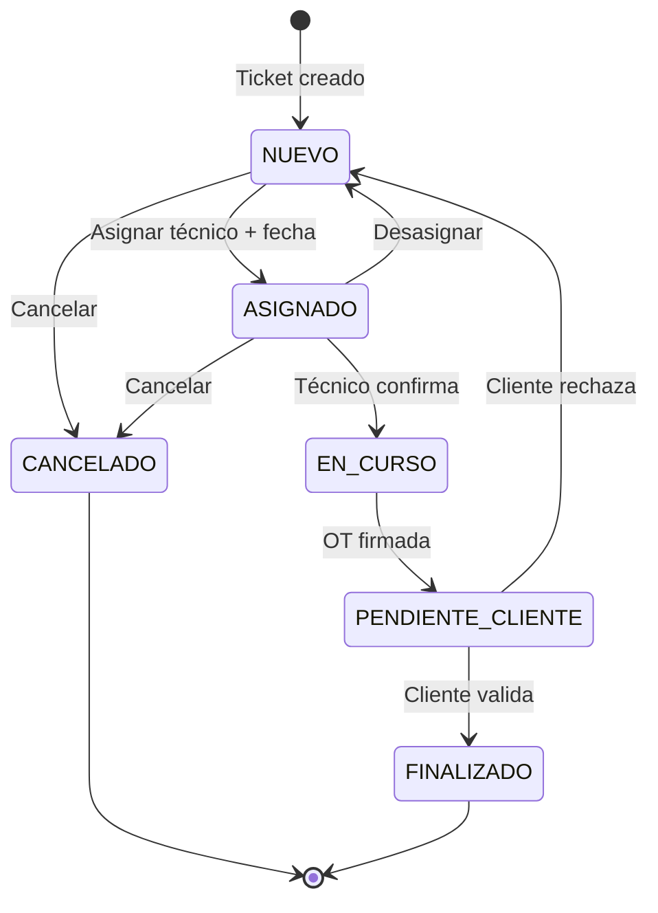

# Flujo de Estados de Tickets

> **Última actualización:** 2026-01-29  
> **Estado:** Definido con cliente (Correo Argentino)

---

## Tipos de Ticket (SLA)

| Código  | Tipo                             | SLA                         | Criterio                                        |
| ------- | -------------------------------- | --------------------------- | ----------------------------------------------- |
| **SEA** | Solicitud Emergencia Alta        | Fin del día HÁBIL siguiente | Afecta el servicio, requiere solución inmediata |
| **SEP** | Solicitud Emergencia Programable | 7 días corridos             | Interfiere con Operación Postal                 |
| **SN**  | Solicitud Normal                 | 15 días corridos            | Programables, no interfieren con operación      |

> **Nota:** El SLA se mide desde la fecha de creación del ticket.

---

## Estados



---

## Descripción de Estados

| Estado                | Descripción                                      | ¿Quién lo cambia?                      |
| --------------------- | ------------------------------------------------ | -------------------------------------- |
| **NUEVO**             | Ticket ingresado, sin técnico asignado           | Sistema (automático)                   |
| **ASIGNADO**          | Técnico asignado + fecha de ejecución programada | Jefe de Operaciones                    |
| **EN_CURSO**          | Técnico confirma que está en camino o trabajando | Técnico                                |
| **PENDIENTE_CLIENTE** | OT firmada, esperando validación del cliente     | Técnico o Administrativo               |
| **FINALIZADO**        | Cliente validó el trabajo                        | Cliente (portal) o Jefe de Operaciones |
| **CANCELADO**         | Cancelado por cliente o decisión interna         | Jefe de Operaciones                    |

---

## Transiciones Válidas

| Desde             | Hacia             | Acción                                  | ¿Quién?                                |
| ----------------- | ----------------- | --------------------------------------- | -------------------------------------- |
| NUEVO             | ASIGNADO          | Asignar técnico + programar fecha       | Jefe de Operaciones                    |
| NUEVO             | CANCELADO         | Cancelar ticket                         | Jefe de Operaciones                    |
| ASIGNADO          | EN_CURSO          | Técnico confirma que va/está trabajando | Técnico                                |
| ASIGNADO          | NUEVO             | Desasignar (cambiar técnico)            | Jefe de Operaciones                    |
| ASIGNADO          | CANCELADO         | Cancelar ticket                         | Jefe de Operaciones                    |
| EN_CURSO          | PENDIENTE_CLIENTE | Enviar foto de OT firmada               | Técnico                                |
| PENDIENTE_CLIENTE | FINALIZADO        | Cliente valida el trabajo               | Cliente (portal) o Jefe de Operaciones |
| PENDIENTE_CLIENTE | NUEVO             | Cliente rechaza (reabrir)               | Cliente (portal) o Jefe de Operaciones |

> **Nota sobre reprogramación:** No hay estado REPROGRAMADO. Si hay que cambiar la fecha, se actualiza en ASIGNADO y se registra en historial.

---

## Validación del Cliente

- Un ticket en **PENDIENTE_CLIENTE** espera la validación del cliente (Correo).
- **Si el cliente valida:** Pasa a FINALIZADO.
- **Si el cliente rechaza:** Vuelve a NUEVO para reasignación.
- **Motivo de rechazo:** Opcional, pero recomendado registrarlo.
- **Sin límite** de rechazos/reaberturas.

> **Visión futura:** Portal web donde el cliente puede ver sus tickets pendientes de validación y confirmarlos directamente, pasando a FINALIZADO automáticamente.

---

## Programación de Fecha

### Fecha de Ejecución

- **Opcional** al asignar técnico
- Los tickets **ASIGNADOS sin fecha** son prioridad para programar
- Sistema sugiere fecha según:
  - **Prioridad del ticket** (SEA → hoy/mañana, SEP → 7 días, SN → 15 días)
  - **Carga de trabajo del técnico** (orientativo)

### Hora de Ejecución

- **Opcional**
- Útil para distribuir trabajos dentro del día

---

## Matriz de Acciones por Estado

| Acción             | NUEVO | ASIGNADO | EN_CURSO | PEND_CLIENTE | FINALIZADO | CANCELADO |
| ------------------ | :---: | :------: | :------: | :----------: | :--------: | :-------: |
| Editar descripción |  ✅   |    ✅    |    ❌    |      ❌      |     ❌     |    ❌     |
| Asignar técnico    |  ✅   |    ✅    |    ❌    |      ❌      |     ❌     |    ❌     |
| Programar fecha    |  ✅   |    ✅    |    ❌    |      ❌      |     ❌     |    ❌     |
| Confirmar trabajo  |  ❌   |    ✅    |    ❌    |      ❌      |     ❌     |    ❌     |
| Enviar OT firmada  |  ❌   |    ❌    |    ✅    |      ❌      |     ❌     |    ❌     |
| Validar (cliente)  |  ❌   |    ❌    |    ❌    |      ✅      |     ❌     |    ❌     |
| Rechazar (cliente) |  ❌   |    ❌    |    ❌    |      ✅      |     ❌     |    ❌     |
| Cancelar           |  ✅   |    ✅    |    ❌    |      ❌      |     ❌     |    ❌     |
| Ver historial      |  ✅   |    ✅    |    ✅    |      ✅      |     ✅     |    ✅     |

---

## Schema Prisma (Propuesto)

```prisma
enum EstadoTicket {
  NUEVO
  ASIGNADO
  EN_CURSO
  PENDIENTE_CLIENTE
  FINALIZADO
  CANCELADO
}

enum TipoTicket {
  SEA  // Solicitud Emergencia Alta
  SEP  // Solicitud Emergencia Programable
  SN   // Solicitud Normal
}
```

---

## Proceso Actual vs Sistema

| Paso         | Hoy (Manual)                             | Sistema SIBA                     |
| ------------ | ---------------------------------------- | -------------------------------- |
| Ingreso      | Email → Administrativo carga en planilla | Email → Sistema (o carga manual) |
| Asignación   | WhatsApp al grupo de zona                | Notificación al técnico + agenda |
| Confirmación | Técnico responde "voy"                   | Técnico cambia estado a EN_CURSO |
| Cierre       | Foto OT por WhatsApp                     | Subir foto OT al ticket          |
| Reporte      | Planilla Excel intercambio               | Dashboard + exportación          |

---

## Fuera de Scope (Por Ahora)

- ❌ Derivación a Obras (presupuestos, trabajos fuera de abono)
- ❌ Preventivos / Patrullaje de técnicos estáticos
- ❌ Integración automática con planilla de intercambio del cliente
